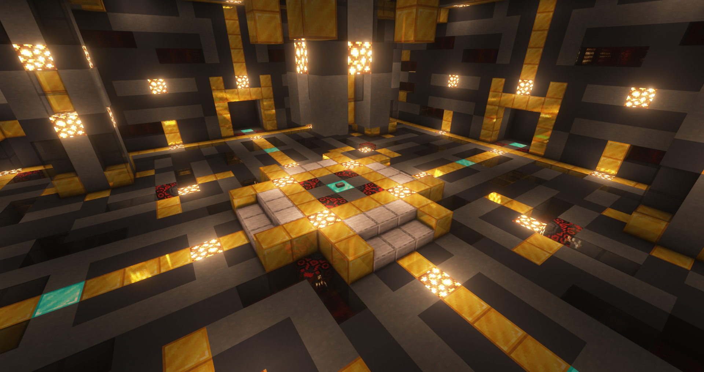

# KotaServer - Arena

## 概要
マルチプレイサーバー「KotaServer」のPvEアリーナ管理用データパックです。
 
### 使い方
  - セットアップ方法
    - ステージの中央にマーカー(tag=Arena.Core)を召喚
    - ステージの手前と奥側の召喚場所にマーカー(手前: tag=Arena.SummonPoint, 奥側: Arena.SummonPoint2)を召喚
    - 上記で召喚したマーカーに同じスコアを設定
    - 入場待機場所と帰還場所にマーカー(待機場所: tag=Arena.Entrance, 帰還場所: tag=Arena.Lobby)
    - それらにも同じスコアを設定
    - 入場待機場所の近くにコマンドブロックを接続したボタンを設置(コマンド: function arena:entrance/_)
    
### 動作環境
- Minecraft JE 1.19.2 -

### Special Thanks (敬称略, アルファベット順)
- ayupara
- elecams
- Hiroki1003
- Kizuna_nAI
- kokuwa
- Youshow322
- yuu2132
